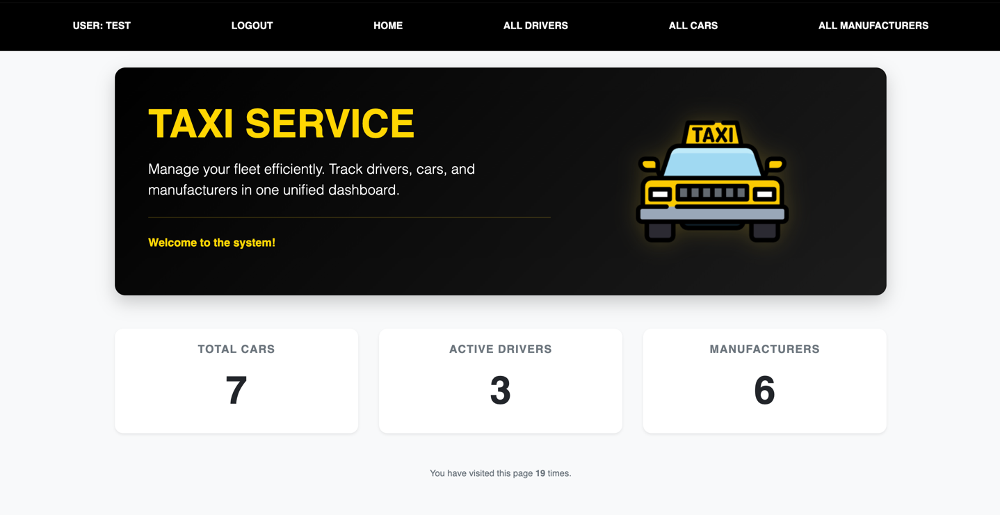

# Taxi Service Project

Django project for managing drivers, cars and manufacturers in Taxi Service

## Check it out

[Taxi Service](http://3.120.51.40:8000/)

## Installation

Python3 must be already installed

```shell
git clone https://github.com/alexandra-halytska/taxi-service
python3 -m venv venv
source venv/bin/activate on Mac OS or venv\Scripts\activate on Windows
pip install -r requirements.txt
python3 manage.py makemigrations
python3 manage.py migrate
python manage.py runserver
```

## Features

* Authentication functionality for Driver/User
* Managing drivers, cars and manufacturers using crud operations from website
* Powerful admin panel for advanced managing

## Demo



## To check project use next credentials:
* login: test
* password: 123456
